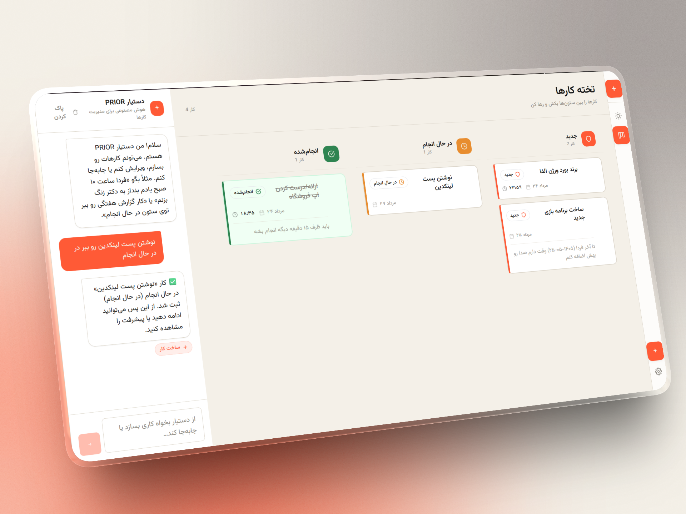

# PRIOR — Persian Todo

<p align="center">
  
</p>

<p align="center">
  <strong>A personal, minimal, brutalist todo app with a Jalali calendar and an AI assistant.</strong><br>
  Built with Tauri v2, React 18, and TypeScript.
</p>

<p align="center">
  
  
  
  
  
</p>

---

<p align="center">
  
</p>

---

## Features

- **Today View** — Jalali (Persian) week strip + agenda list with optional time & duration per task
- **Board View** — Kanban columns: **New → Doing → Finished**, full drag-and-drop via `@dnd-kit`
- **AI Assistant (PRIOR)** — Natural language in Persian/English creates, edits, moves, deletes todos via real tool calls
- **Bring Your Own Model** — Any OpenAI-compatible endpoint (OpenAI, OpenRouter, Groq, Together, Ollama, LM Studio, etc.)
- **100% Local-First** — SQLite on your machine, API key stored locally, direct API calls — no third-party servers

## Design: PRIOR

Minimal, premium, editorial, slightly brutalist aesthetic:

| Color | Hex | Role |
|-------|-----|------|
| **Ink** | `#171717` | Primary text |
| **Paper** | `#F4F0E8` | Background |
| **Signal** | `#FF5A36` | Primary accent (AI, actions) |
| **Muted** | `#8B8780` | Secondary text |
| **Border** | `#DDD7CC` | Dividers, borders |

- Strong typographic hierarchy (custom editorial scale)
- Generous whitespace, clean 1–2px borders
- Subtle layered shadows, no gradients/glassmorphism
- Signal orange as the distinctive accent

## Stack

| Layer | Technology |
|-------|------------|
| Shell | Tauri v2 (Rust) |
| Database | `tauri-plugin-sql` (SQLite) |
| Network | `tauri-plugin-http` (CORS-free fetch) |
| Frontend | React 18 + TypeScript + Vite |
| Styling | Tailwind CSS (custom design tokens) |
| Calendar | `jalaali-js` (Jalali/Gregorian conversion) |
| Drag & Drop | `@dnd-kit` |
| Font | `@fontsource/vazirmatn` (Persian, bundled offline) |

## Prerequisites

1. **Node.js** 18+ and npm
2. **Rust** — install via [rustup.rs](https://rustup.rs)
3. **Tauri system dependencies** for your OS — see [official list](https://v2.tauri.app/start/prerequisites/)
   - macOS: Xcode Command Line Tools
   - Windows: Microsoft C++ Build Tools + WebView2 (preinstalled on Win 11)
   - Linux: `webkit2gtk`, `libayatana-appindicator3`, etc.

## Quick Start

```bash
# Install dependencies
npm install

# Run in development mode
npm run tauri dev
```

First launch creates `todo.db` (SQLite) in the app data directory automatically.

## Build Native Installer

```bash
npm run tauri build
```

Outputs land in `src-tauri/target/release/bundle/`.

### App Icons

Icons are generated from `assets/logo.png` using Tauri's icon generator:

```bash
npm run tauri icon assets/logo.png
```

## Using the AI Assistant (PRIOR)

1. Open **Settings** (gear icon in the left rail)
2. Pick a preset or paste any OpenAI-compatible base URL:
   - OpenAI: `https://api.openai.com/v1`
   - OpenRouter: `https://openrouter.ai/api/v1`
   - Groq: `https://api.groq.com/openai/v1`
   - Together AI: `https://api.together.xyz/v1`
   - Local (Ollama/LM Studio): `http://localhost:11434/v1`
3. Paste your API key and a model name supporting **tool/function calling**:
   - `gpt-4o-mini`, `gpt-4o` (OpenAI)
   - Most chat models (OpenRouter)
   - `llama-3.3-70b-versatile` (Groq)
4. Open the chat sidebar (spark icon) and talk naturally:
   - *"سازمان فردا ساعت ۱۰ صبح یادم بنداز به دکتر زنگ بزنم"*
   - *"Move the quarterly report task to Doing"*
   - *"Show me all tasks for this week"*
   - *"Delete the old meeting notes task"*

**Available tools:** `list_todos`, `create_todo`, `update_todo`, `move_todo`, `delete_todo`

## Project Structure

```
persian-todo/
├── assets/
│   ├── logo.png        # App logo (source for icon generation)
│   └── mockup.png      # App screenshot for README
├── src/
│   ├── components/
│   │   ├── TodayView.tsx      # Jalali week strip + agenda
│   │   ├── BoardView.tsx      # Kanban board (dnd-kit)
│   │   ├── TodoCard.tsx       # Task card + draggable wrapper
│   │   ├── TodoModal.tsx      # Create/edit form
│   │   ├── ChatSidebar.tsx    # PRIOR AI chat panel
│   │   └── SettingsModal.tsx  # API config with presets
│   ├── lib/
│   │   ├── types.ts           # Todo, AppSettings, ChatMessage types
│   │   ├── jalali.ts          # Jalali calendar + Persian digit helpers
│   │   ├── db.ts              # SQLite data access (todos + settings + chat history)
│   │   └── ai.ts              # OpenAI-compatible client + tool-calling loop
│   ├── App.tsx                # Main layout + nav rail
│   ├── main.tsx               # React entry
│   └── index.css              # Global styles + design system utilities
├── src-tauri/
│   ├── src/main.rs            # Registers sql + http plugins
│   ├── tauri.conf.json        # Window, bundle, CSP config
│   └── capabilities/default.json  # Permission scopes
├── tailwind.config.js         # PRIOR design tokens
├── package.json
└── README.md
```

## Key Implementation Details

- **Chat history persists** across app restarts (stored in SQLite)
- **Settings apply immediately** — no restart needed after saving API config
- **Dates stored as Jalali strings** (`"1403-05-24"`) — native to UI and AI tools
- **Time format** — 24h `"HH:MM"` as Tehran local time
- **CSP disabled** (`"csp": null`) — allows any configured AI endpoint (personal app)
- **Keyboard shortcuts in Settings** — `Esc` to close, `Cmd/Ctrl+Enter` to save

## Scripts

```bash
npm run dev          # Vite dev server only
npm run build        # TypeScript + Vite production build
npm run preview      # Preview production build
npm run tauri dev    # Full Tauri dev (Vite + Rust)
npm run tauri build  # Full Tauri production build
```

## License

MIT — feel free to fork and customize for your own workflow.